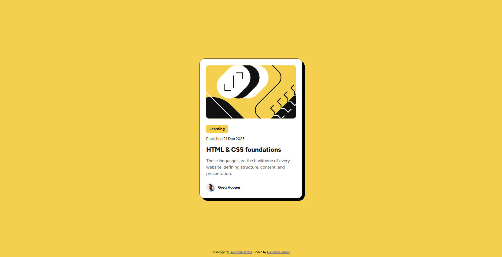

# Frontend Mentor - Blog preview card solution

This is a solution to the [Blog preview card challenge on Frontend Mentor](https://www.frontendmentor.io/challenges/blog-preview-card-ckPaj01IcS). Frontend Mentor challenges help you improve your coding skills by building realistic projects. 

## Table of contents

- [Overview](#overview)
  - [The challenge](#the-challenge)
  - [Screenshot](#screenshot)
  - [Links](#links)
- [My process](#my-process)
  - [Built with](#built-with)
  - [What I learned](#what-i-learned)
  - [Continued development](#continued-development)
- [Author](#author)

## Overview

### The challenge

Users should be able to:

- See hover and focus states for all interactive elements on the page

### Screenshot



### Links

- Solution URL: https://github.com/HammamYousef/Blog-preview-card
- Live Site URL: https://hammamyousef.github.io/Blog-preview-card/

## My process

### Built with

- Flexbox
- Media queries
- Custom CSS variables
- CSS custom fonts

### What I learned

While building this project, I reinforced my understanding of Flexbox for layout and responsive design using media queries. I also practiced using CSS custom properties (variables) for consistent theming and learned how to implement custom fonts with `@font-face`.

Some code snippets I'm proud of:

```css
:root {
  --Yellow: hsl(47, 88%, 63%);
  --White: hsl(0, 0%, 100%);
  --Gray-500: hsl(0, 0%, 42%);
  --Gray-950: hsl(0, 0%, 7%);
}
#card {
  display: flex;
  flex-direction: column;
  gap: 24px;
  box-shadow: 8px 8px 0px 0px #000;
}
```

```html
<div id="card-author">
  
  <span id="author-name">Greg Hooper</span>
</div>
```

### Continued development

In future projects, I want to:

- Explore CSS Grid for more complex layouts.
- Improve accessibility by using semantic HTML and ARIA attributes.
- Practice more advanced responsive techniques for different device sizes.
- Learn about CSS transitions and animations for interactive effects.

## Author

- Frontend Mentor - [@HammamYousef](https://www.frontendmentor.io/profile/HammamYousef)


